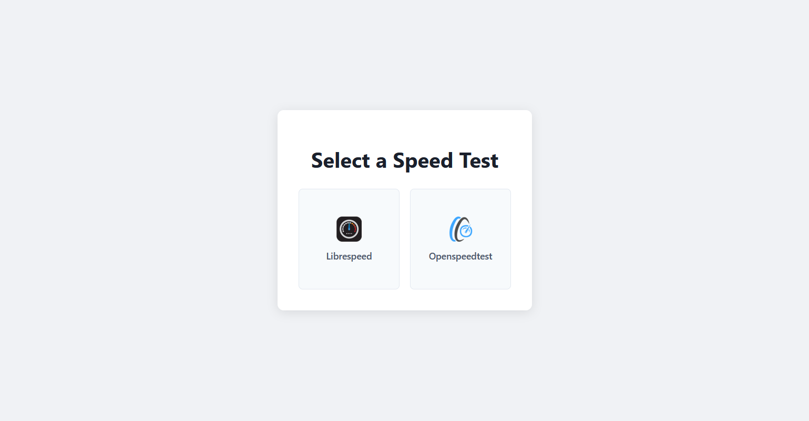

# Automated Speed Test Hub Deployer

A Bash script to automatically deploy a web-based, self-hosted network speed test hub on a Debian-based Linux system (like Ubuntu). This script installs and configures all necessary dependencies, including Apache2 and PHP, and deploys both **LibreSpeed** and **OpenSpeedTest**.

The final result is a clean, dynamic landing page that lets users choose which speed test they want to run.




## Features

- **Fully Automated:** Single-command execution to set up a complete speed test environment.
- **Dependency Management:** Installs Apache2, PHP, and all required PHP extensions (`gd`, `sqlite3`, `xml`, `curl`).
- **Optimized PHP Config:** Automatically updates `php.ini` for better performance with speed test applications (e.g., sets `post_max_size` to unlimited).
- **Dual Applications:** Deploys two popular, open-source speed test applications:
  - [LibreSpeed](https://github.com/librespeed/speedtest)
  - [OpenSpeedTest](https://github.com/openspeedtest/Speed-Test)
- **Dynamic Landing Page:** A beautiful, responsive landing page automatically detects any applications you add to the web root, using their `favicon.ico` as a link.
- **Modular & Clean Code:** The deployment script is well-structured with functions for each step, making it easy to read and maintain.
- **Idempotent-Friendly:** The script cleans the web directory before deployment, ensuring a consistent state on every run.

## Repository Structure

```
.
├── setup.sh               # The main deployment script.
├── index.php              # The source file for the dynamic landing page.
└── README.md              # This file.
```

## Prerequisites

- A server running a Debian-based OS (e.g., **Ubuntu 22.04/24.04**).
- Root or `sudo` privileges.
- An active internet connection to download packages and source code.
- Ports `80` (HTTP) and/or `443` (HTTPS) open in your firewall to access the web server.

## Installation & Usage

Getting started is simple. Just follow these steps:

1.  **Clone the repository:**
    ```bash
    git clone https://github.com/SafeSquid-Github/speedtest_complied.git
    cd speedtest_complied
    ```

2.  **Run the script:**
    ```bash
    bash setup.sh
    ```
    The script will now automate the entire setup process. It will provide progress updates at each step.

3.  **Access your Speed Test Hub:**
    Once the script finishes, it will display the server's IP address. Open your web browser and navigate to `http://your-server-ip/`. You will be greeted by the landing page, from where you can launch either speed test.

## How It Works

The `setup.sh` script performs the following actions in order:

1.  **Checks Environment:** Verifies it's run as root and that the `index.php` landing page file is present.
2.  **Installs Dependencies:** Updates `apt` and installs `apache2`, `php`, `git`, `unzip`, `wget`, `tree`, and necessary PHP modules.
3.  **Configures PHP:** Locates the `php.ini` file for Apache, creates a backup, and updates it to enable extensions and allow for large file uploads.
4.  **Sets Up Directories:** Stops Apache, cleans the default web root (`/var/www/html`), and creates the folder structure for the speed test apps.
5.  **Deploys LibreSpeed:** Clones the official repository, copies the files to `/var/www/html/librespeed`, downloads required libraries, and sets the correct permissions for saving results.
6.  **Deploys OpenSpeedTest:** Downloads the latest release, extracts it to `/var/www/html/openspeedtest`, and makes its favicon easily accessible.
7.  **Deploys Landing Page:** Copies the `index.php` file from this repository to `/var/www/html/index.php`.
8.  **Finalizes Setup:** Restarts and enables the Apache service to apply all changes.
9.  **Shows Summary:** Displays a confirmation message with the access URLs.

## Important Post-Installation Note

### LibreSpeed GeoIP Database

To enable the GeoIP feature in LibreSpeed (which shows the user's country and ISP), you need to download a GeoLite2 database from MaxMind. This now requires a free license key.

1.  Sign up for a free account at [MaxMind](https://www.maxmind.com/en/geolite2/signup).
2.  Generate a license key.
3.  Download the **GeoLite2-Country** database in `.mmdb` format.
4.  Rename the file to `country_asn.mmdb`.
5.  Place this file in `/var/www/html/librespeed/backend/`, replacing the empty placeholder file created by the script.

## Customization

### Modifying the Landing Page

To change the appearance of the landing page, simply edit the `index.php` file in this repository *before* running the deployment script.

### Adding More Applications

The landing page is fully dynamic! To add another web application:
1.  Create a new directory for your app inside `/var/www/html/`, for example:
    ```bash
    sudo mkdir /var/www/html/my-new-app
    ```
2.  Place your application's files in that directory.
3.  Ensure your application has an `index.html` or `index.php` file in its root.
4.  (Recommended) Place a `favicon.ico` file in the application's root (`/var/www/html/my-new-app/favicon.ico`).

That's it! Refresh the main landing page, and your new application will automatically appear as an option.

## Contributing

Pull requests are welcome! For major changes, please open an issue first to discuss what you would like to change.